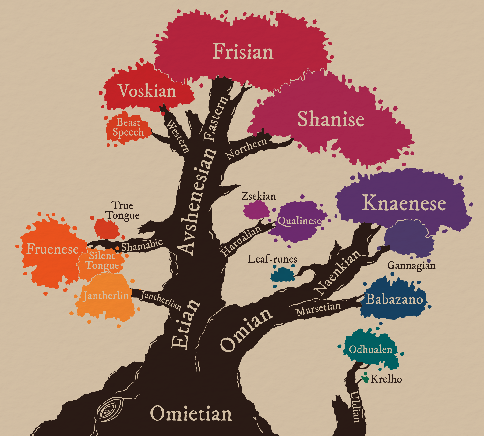

**WIP.**

# Yuadrem
<!--
TODO LIST:
* Finish this first index page. It's the first thing player see in the wiki!
* Check if I can link to a section in a file -- that would make links so much
    more useful.
* Check links **regularly**. They break often.
* ADD COATIS.
* Explain somewhere that anything before the penance is called "pre-penance".
-->

Yuadrem was first settled by the firstborn oric gods, [Et](religions/tanethism_pantheon.md#et) and [Om](religions/tanethism_pantheon.md#om). Et was a large and thin birch, pliable and adaptable. Om was a short and stout juniper, vigorous and prodigious. These two gods were ever locked in combat, yet none could take the upper hand. This conflict became known as the War of Spring<!-- TODO. Link. -->.

To aid in the eternal battle, Et created the [humes](kins/hume.md), a kin as malleable as the god. Et bestowed upon humes Chromology<!-- TODO. Link. -->, teaching them to wage war using Color. Om in turn created [marsets](kins/marset.md), a smaller kin able to traverse the forests of Et's children with ease. The marsets were gifted Apomantics<!-- TODO. Link. -->, and fought using Word.

The conflict ended with the burning of Om, an event known as the Schism<!-- TODO. Link. -->. the primordial one [Pheter](religions/tanethism_pantheon.md#pheter), angered by the death of the god, retaliated by striking Et with lightning. The blast burned the god-tree, and brought the 40-Year Famine<!-- TODO. Link. --> to both humes and marsets. This event marks the year 0, and the beginning of history.

--------------------------------------------------------------------------------
## Geography
<!-- TODO LIST:
    * Finish the geography folder, + move mostly everything to the past tense. Make sure the reader knows that the world is dying!
-->

***Pictured:***
*Trade map of Yuadrem, drawn in 604 A.S. (After the Schism) by Marim of Avshen under the commission of Olag, the God-Suzerain of Naptane. The region colored in green corresponds to the Seven Protectorates of the Sea. Other colors represent the tax and penalty applied to trade in those regions. This map is proof of the healthy state of maritime travel and trade during the golden age.*

Yuadrem is a supercontinent, the only such landmass in the world, Darhoc<!-- TODO. Link. -->. The topography is varied, split by four different mountain ranges. Due to its large extension from north to south, the climate and ecology vary widely, from the tundras of [Stinos](geography/northern_territories.md#stinos) to the rainforests of [Drejek](geography/westlands.md#krejek).

Due to its size, Yuadrem is often divided into six distinct regions: the [Northern Territories](geography/northern_territories.md), the [Westlands](geography/westlands.md), the [Fractured Lands](geography/fractured_lands.md), the [Sunland](geography/sunland.md), the [Savage Territories](geography/savage_territories.md), and the [Wildlands](geography/wildlands.md). In addition, the four oceans that surround it are:

* The Frigid Ocean to the north-east, which is known for its low temperatures and abundance of migratory idzels<!-- TODO. Link. -->, large sea monsters famous for wrecking ships during the golden age.
* The warm Teal Ocean to the north-west, home to a varied marine life.
* The Burnt Ocean to the east, both devoid of life and impossible to sail since the landing of [Cabb Goem-Rlamesh](geography/sunland.md#cabb-goem-rlamesh).
* The Southern Ocean to the south, the least explored of the four.
<!-- TODO. Maybe change most of this to the past tense? -->

--------------------------------------------------------------------------------
## Sociology
### Politics
Back in the golden age, Yuadrem was split into various nations, each with their own population centers and varied economies. This era of peace lasted until the death of god-suzerain Olag<!-- TODO. Link. --> in 621 A.S. (After the Schism), an event that sparked the Penance<!-- TODO. Link. -->. With the Penance, an irisdescent tar known as nix<!-- TODO. Link. --> began rolling over the continent. This caused mass migrations, separating the peoples into isolas.

An isola is defined as a region either devoid of nix, or only seasonably affected by it. Most isolas are protected by their topography, often aided by strong sorcerers known as [Illuminants](religions/tanethism_pantheon.md#illuminants). Up to the year 800 A.S., the only known isola was the [Fesh Peninsula](isolas/fesh_peninsula/index.md). After the arrival of the nixwalkers<!-- TODO. Link. -->, dentrala<!-- TODO. Link. --> apomancers<!-- TODO. Link. --> who travel over the vapors released by nix, it is now known that at least three others isolas exist: [Krugghom](isolas/krugghom/index.md), the [Steldan Isola](isolas/steldan_isola/index.md), and the Coldmist Gorge<!-- TODO. Link. -->.

<!-- TODO. Talk about the nations of the Fesh Peninsula. -->

### Ethnology

***Pictured:***
*Old world migration map of Yuadrem, drawn in 787 A.S. by the Fremite Monastery in Uvarme. It includes all known mass movements of people from the ird diasporas of ~80 B.S. to the Na'anian migration of 445 A.S. Migrations after the Penance are not pictured. The authors separated the four kins (and gats from irds) using colored lines.*

The peoples of Yuadrem are separated into four distinct kins. Each kin was created by a different god-tree, and each was then further divided by ethnic differences. These differences led to the formation of nations during the Golden Age<!-- TODO. Link. -->, the erosion of which later led to the [sumis](isolas/fesh_peninsula/ane-kene.md#buda_and_sumi).

* [Humes](kins/hume.md), born from Et, are as adaptable as their creator. They became the dominant kin in Yuadrem after the Schism, and remain in this position even after the Penance.
* [Marsets](kins/marset.md), born from Om, are hardy nomads that roam the remaining forests of Yuadrem. Decimated by both the War of Spring and posterior genocides, they have proven to be a deceptively hardy people.
* [Oths](kins/oth.md) are a moth-like kin, a quiet people with a natural tendency towards knowledge. Created by the god-tree [Tol](religions/tanethism_pantheon.md#tol), they're often seen as enigmatic as their creator.
* [Barkskins](kins/barkskin.md) are bone and wood golems, animated by the [god-tree Tek](religions/tanethism_pantheon.md#tek). While often considered too aggressive for peaceful interaction, an alliance has been recently broken between them and the sumi of Fremit<!-- TODO. Link. -->.

<!-- TODO. Maybe talk a bit about each kin and their relevant migrations. -->

***Pictured:***
*Age of Fog migration map of the Fesh Peninsula, drawn in 801 A.S. by the Fremite Monastery in Uvarme. It includes all mass migrations with their approximate dates.*

Different events in prehistory and history have caused migrations and diasporas, but none can be compared to The Penance. In the face of the vast loss of landmass to the nix tides, peoples from all nations and ethnicities coalesced in the Fesh Peninsula.

<!-- TODO. Maybe talk a bit about each migration. -->

### Religion
The main religion practiced in the Fesh Peninsula is Tanethism.

Old Tanethism is characterized by its myriad of gods -- one for each apomantic signature<!-- TODO. Link. -->. This religion was widely practiced in the Seven Principates<!-- TODO. Link. --> and their various colonies up until the late Age of Gold<!-- TODO. Link. -->. This however changes in the year 520 A.S., when the god-suzerain Olag<!-- TODO. Link. --> establishes a new Tanethism as the official religion of the principates.

The religion is based on a book published by Taneth in 511 A.S. To write it, the nomadic scholar traveled all around the various principates and city-states. He ended up with an exhaustive compilation of the more than a thousand deities praised in the region. In this taxonomy, Taneth classifies the similitude and difference between each god. Based on these, he then proposes a reduced [pantheon](religions/tanethism_pantheon.md) in which similar gods coalesce, along with a clear, tiered hierarchy between them.
<!-- TODO. Maybe change dates here, make them earlier. -->

Taneth's work was barely known during his life. He died shortly after the publication, and not even his birth date is known.

Many a hume has a favorite among the gods, one whose ideals and teaching they make their own. A few even dedicate entirely to a single deity, serving as a priest, acolyte, or champion of that god's manifestation. Some famous examples among these devouts are the nimrods, an organization of zealous hunters of [Pagram](religions/tanethism_pantheon.md#pagram) who would pursue all who disturb the perceived balance. Another example are the followers of [Havetish](religions/tanethism_pantheon.md#havetish), who to this date seek to distribute wealth and food to the impoverished habitants in the inland regions.

Other religions do exist, but receive little attention in the modern world. Once widely practiced, the three most notorious ones are [Tsalemism](religions/tsalemism.md), [Igneism](religions/igneism.md), and [Cosmism](religions/cosmism.md).

### Languages
<!-- TODO LIST:
    * Eventually, I need to add links to all nations from this page.

    NOTE. It would be cool to add some descriptive text to the tree, but maybe it's not a priority at the moment.
-->

*A comprehensive overlook of the languages spoken in the Fesh Peninsula, 798 A.S. The branches represent the branching of language families, while the leaf clusters are the languages currently spoken. The size of each leaf cluster is a rough approximation of the number of speakers by the year of production. Recorded by the Umean monastery.*

There are 16 recognized languages spoken in the Fesh Peninsula. They are separated into two distinct trees: Omietian languages and Uldian languages.

Omietian languages are those that were taught by Et, Om, and Tol to their respective kins: humes, marsets, and oths. While etian and omian languages were taught by different god-trees, they have many common roots. Due to this, it is theorized that they came from one original language.

#### Etian Family
**Jantherlin** is the earliest known language that is still spoken. It was taught by Et to the first humes, and has been carefully preserved over the years by monks and scholars. In modern times, Jantherlin is only spoken in academic contexts, and its writing system is the base of the etian apomantic system<!-- TODO. Link. -->.

#### Avshenesian Family
Over time, jantherlin developed into most of the languages spoken in Yuadrem. The largest branch of these is the avshenesian family. Originally spoken in the Seven Principates, it spread wide into the continent, only for the languages to coalesce again into the Fesh Peninsula. The avshenesian apomantic system<!-- TODO. Link. --> started from the mother language of the family, which is usually used by the commons due to its simplicity.

* **Frisian** was the language spoken in the peninsula before The Penance, and remains the most common language in the region. It is currently spoken in the sumis of Fremit, Ushpavam, Vamerit, and Xarxage, as well as in the Holy Nation of Ushpavam and the Nation of Meritan. A dialect of old Avshenesian, very similar to Frisian, is also spoken by the chiefdoms of Raraspan and Dzarog, as well as by the Ketepi people.
* **Shanise** is the main language spoken in the Northern Territories, and it branched out from Avshenese in the thulkrakan side of the ird diaspora. As of 802 A.S., it is only spoken in the Nation of Gronselar. Shanise is the basis for the gronselarian apomantic system<!-- TODO. Link. -->
* **Voskian** is a family of languages that developed north of the [Zoedrem desert](geography/westlands.md#zoedrem), with the dispersion of the Bughna people in the northern bughna migration. It is not currently spoken in any nation, but the family is very common in the six thousand tribes and the peoples of Saefel.
* **Beash Speech** is an artificial language developed in Voskferm, a now dead nation. The language was developed to communicate with the highly intelligent Anthutes<!-- TODO. Link. -->. It is now used by merchants and travelers to ride these creatures across the sumis of the Fesh Peninsula.

#### Harualian Family
Some time before the avshenesian family sprouted from Jantherlin, the harualian family started taking shape after the hairusse, qulbaban, and dratlean sides of the ird diaspora. While there were many harualian languages existed in the old world, only two survived The Penance.

* **Qualinese** was the main language spoken in the Jenkashian empire. While the empire was lost to nix, some of its people migrated to the Fesh Peninsula. The language is now spoken by the Puneui People and is the second most common language in the sumi of Fremit.
* **Zsekian** was the language of the Hulnar empire. Very few native speakers remain in the modern world, but the language still sees some use in the chiefdoms of Raraspan and Dzarog, as well as by the Ketepi people.

#### Shamabic Family
After the god-tree Tol spawned from the corpse of Et, it spawned the oth kin. Oths quickly integrated into the Seven Principates, but developed their own languages from Jantherlin: the Shamabic family.

* **Fruenese** was the first language developed by the oths. It is a highly practical language with a simple syntax, reflecting the pragmatism of the kin. Fruenese is now the main language spoken in the chiefdom of Nalash and the island of Trevit.
* The **Silent Tongue** was the second language developed by oths. It doesn't have a writing system, as it uses only visual-manual signs to convey meaning. Despite it being an artificial language, it's separate into many different dialects. It can be seen in the entire Fesh Peninsula, but it is seen the most in the sumi of Fremit. It is the basis for the dentralin apomantic system<!-- TODO. Link. -->
* The **True Tongue** was the third and final language developed by oths. Also based on Fruenese, it adds to it a large set of unique and very complicated grammatical rules. These make the language exceedenly hard to learn, but give it a unique advantage: it is impossible to lie in True Tongue, hence its name. The language is most commonly spoken by political figures, diplomats, and scholars.

#### Omian Family
**Babazano** was the only language taught by Om to their descendants, the marsets. It is a very repetitive language with little verb variety, making it somewhat easy to learn. It has only 10 consonants, making lip movements very easy to identify. As such, most speakers learn to read lips fairly easily. Currently, Babazano is the only language spoken in the Nation of Om.

#### Naenkian Family
Since they do most of their communication through spores, the god-tree Tek did not teach any language to barkskins. They were, however, later taught language by marsets, in an attempt to establish communication. Barkskins learned babazano, which quickly morphed into the naenkian language family due to their unique morphology.

* **Knaenese** is the most common language in the naenkian family. Lacking teeth and lips, barkskins communicate only with their alveolar ridge and palate, producing rough-sounding words. Knaenese is currently spoken only in the Nation of Knagan.
* **Gannagian**, sometimes referred to as Old Knaenese, sounds very similar to knaenese, but is generally simpler. Lacking the proximity to Tek, and thus its spores, the barkskins of Knagan had to further develop their language, leading to this differentiation. Gannagian is only spoken in Gannag. Gannagian is the basis for the gannagian apomantic system<!-- TODO. Link. -->.
* **Leaf-runes** is a written language developed by marsets and barkskins, used to communicate between the two. The language is written into the bark of trees, and the shape of each gliph depends on the shapes of this bark. This makes it very hard for other kins to understand the writing, but is fairly simple for the two due to their intimate relation with trees. Leaf-runes are mostly used to provide guidance or help in the jungle in a secretive manner.

#### Uldian Family
Uldian languages were developed independently by the oths of Ignelli<!-- TODO. Link. -->, under the tutelage of the god-tree [Uld](religions/tanethism_pantheon.md#uld). These languages saw some success in the region, but never spread too far from Ignelli.

* **Odhualen** is a very unique language, sharing only broad characteristics with the other dialects of Yuadrem. The language has recently become somewhat popular among monks and scholars due to the fact that its writing system is exceptionally compact. It is the main language spoken in the island of Mbeat.
* **Krelho** was a variation of Odhualen born as the language spread across the [Wildlands](geography/wildlands.md). It has almost disappeared after The Penance, with more people interested in learning Odhualen rather than its obscure cousin language.

--------------------------------------------------------------------------------
## History
**TODO.**

<!-- **TODO. Mention Tol and Taneth.** -->

<!-- PREHISTORY --------------------------------------------------------------->
### Prehistory
* **Nascency of Disparity.** The primordial [Pheter](religions/tanethism_pantheon.md#pheter), god of disparity, is born from [Nix](religions/tanethism_pantheon.md#nix). With Pheter comes the separation of land and sea, and thus Yuadrem is created.
* **Nascency of Color.** From Pheter, the two [damic gods](religions/tanethism_pantheon.md#damic-gods) are born: [Zash](religions/tanethism_pantheon.md#zash), the sun, and [Fagal](religions/tanethism_pantheon.md#fagal), the darksun. Zash in turn is divided into his six aspects, the [mevic gods](religions/tanethism_pantheon.md#mevic-gods), which conform Color.
* **First Communion.** To populate Yuadrem, each mevic god plants a seed. These seeds grow into the [oric gods](religions/tanethism_pantheon.md#oric-gods), the first life to stand on Yuadrem.
* **War of Spring.** The largest of the oric gods, Et and Om, go into war. While no damic or mevic god interfered, Pheter themself was against the conflict. Humes are born from Et as soldiers in this war, while Om creates the marsets to defend themself.
<!-- TODO. Add the Ird Diaspora + the first siege of Ctereth. -->
* **The Schism.** After a long and bloody conflict, Et wins the war against Om. Under the orders of their god-tree, the gats burn down the god-tree of the marsets. As the fire spreads, Pheter creates the fundamental signature of lightning<!-- TODO. Link. --> on the surface of the moon Kegal<!-- TODO. Link. -->, ans uses it to strike down Et. The ash from the burned god-trees engulfs Yuadrem, sparking the Age of Dark with the 40-Year Famine.
<!-- TODO. Add the Gat Diaspora (Bughna and Treb). -->

<!-- NOTE. Ededeian genocide ends with the death of king D'khan at the hands of Genadi. -->

<!-- TODO. Maybe change the dates using a random number generator (within reason). -->
<!-- AGE OF DARK -------------------------------------------------------------->
### Age of Dark
*0 to 195 A.S.*

**TODO.**

<!--
* **TODO. 32 A.S. The Ctereth sieges & the Armies of Healing.**
* **TODO. 96 A.S. Founding of Naptane.**
* **TODO. 141 A.S. Discovery of the barkskins.**
* **TODO. 195 A.S. Establishment of the 7 principates of the sea and beginning of the reign of the god-suzerain Olag.**
-->

<!-- GOLDEN AGE --------------------------------------------------------------->
### Golden Age
*195 to 621 A.S.*

**TODO.**

<!-- * **TODO. Nascency of Oths.** -->
<!-- * **TODO. Establishment of Tanethism as the main religion.** -->

<!-- AGE OF FOG --------------------------------------------------------------->
### Age of Fog
*621 A.S. to present day.*

**TODO.**

<!-- * **TODO. 734 A.S. Landing of Drejek.** -->

<!-- NOTE. Present day: 802 A.S. -->

--------------------------------------------------------------------------------
<!-- COSMOLOGY ---------------------------------------------------------------->
## Cosmology
**TODO.**

--------------------------------------------------------------------------------
For documentation on editing this wiki, check out:

* [mkdocs.org](https://www.mkdocs.org).
* [mkdocs-material](https://squidfunk.github.io/mkdocs-material/creating-your-site/).
