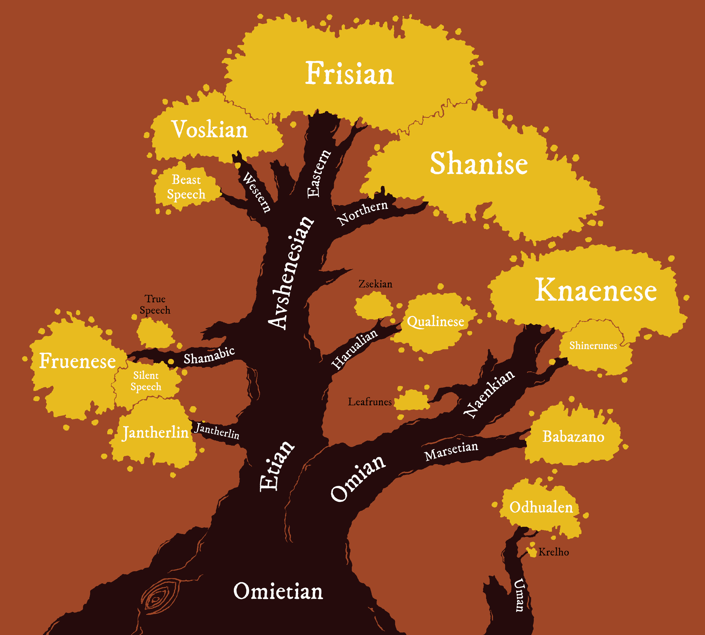

**WIP.**

# Yuadrem
<!--
TODO LIST:
* Finish this first index page. It's the first thing player see in the wiki!
* Check if I can link to a section in a file -- that would make links so much
    more useful.
* Check links **regularly**. They break often.
* ADD COATIS.
-->

Yuadrem was first settled by the firstborn oric gods, [Et](religions/tanethism_pantheon.md#et) and [Om](religions/tanethism_pantheon.md#om). Et was a large and thin birch, pliable and adaptable. Om was a short and stout juniper, vigorous and prodigious. These two gods were ever locked in combat, yet none could take the upper hand. This conflict became known as the War of Spring<!-- TODO. Link. -->.

To aid in the eternal battle, Et created the [humes](kins/hume.md), a kin as malleable as the god. Et bestowed upon humes Apomantics<!-- TODO. Link. -->, teaching them to wage war using Word. Om in turn created [marsets](kins/marset.md), a smaller kin able to traverse the forests of Et's children with ease. The marsets were gifted Chromology<!-- TODO. Link. -->, and fought using Color.

The conflict ended with the burning of Om, an event known as the Schism<!-- TODO. Link. -->. the primordial one [Pheter](religions/tanethism_pantheon.md#pheter), angered by the death of the god, retaliated by striking Et with lightning. The blast burned the god-tree, and brought the 40-Year Famine<!-- TODO. Link. --> to both humes and marsets. This event marks the year 0, and the beginning of history.

--------------------------------------------------------------------------------
## Geography

***Pictured:***
*Trade map of Yuadrem, drawn in 604 A.S. (After the Schism) by Marim of Avshen under the commission of Olag, the God-Suzerain of Naptane. The region colored in green corresponds to the Seven Protectorates of the Sea. Other colors represent the tax and penalty applied to trade in those regions. This map is proof of the healthy state of maritime travel and trade during the golden age.*

Yuadrem is a supercontinent, the only such landmass in the world, Darhoc<!-- TODO. Link. -->. The topography is varied, split by four different mountain ranges. Due to its large extension from north to south, the climate and ecology vary widely, from the tundras of [Stinos](geography/northern_territories.md#stinos) to the rainforests of [Drejek](geography/westlands.md#krejek).

Due to its size, Yuadrem is often divided into six distinct regions: the [Northern Territories](geography/northern_territories.md), the [Westlands](geography/westlands.md), the [Fractured Lands](geography/fractured_lands.md), the [Sunland](geography/sunland.md), the [Savage Territories](geography/savage_territories.md), and the [Wildlands](geography/wildlands.md). In addition, the four oceans that surround it are:

* The Frigid Ocean to the north-east, which is known for its low temperatures and abundance of migratory idzels<!-- TODO. Link. -->, large sea monsters famous for wrecking ships during the golden age.
* The warm Teal Ocean to the north-west, home to a varied marine life.
* The Burnt Ocean to the east, both devoid of life and impossible to sail since the landing of [Cabb Goem-Rlamesh](geography/sunland.md#cabb-goem-rlamesh).
* The Southern Ocean to the south, the least explored of the four.
<!-- TODO. Maybe change most of this to the past tense? -->

--------------------------------------------------------------------------------
## Sociology
### Politics
Back in the golden age, Yuadrem was split into various nations, each with their own population centers and varied economies. This era of peace lasted until the death of god-suzerain Olag<!-- TODO. Link. --> in 621 A.S. (After the Schism), an event that sparked the Penance<!-- TODO. Link. -->. With the Penance, an irisdescent tar known as nix<!-- TODO. Link. --> began rolling over the continent. This caused mass migrations, separating the peoples into isolas.

An isola is defined as a region either devoid of nix, or only seasonably affected by it. Most isolas are protected by their topography, often aided by strong sorcerers known as [Illuminants](religions/tanethism_pantheon.md#illuminants). Up to the year 800 A.S., the only known isola was the Fesh Peninsula<!-- TODO. Link. -->. After the arrival of the nixwalkers<!-- TODO. Link. -->, dentrala<!-- TODO. Link. --> apomancers<!-- TODO. Link. --> who travel over the vapors released by nix, it is now known that at least three others isolas exist: [Krugghom](isolas/krugghom/index.md), the [Steldan Isola](isolas/steldan_isola/index.md), and the Coldmist Gorge<!-- TODO. Link. -->.

### Ethnology

***Pictured:***
*Migration map of Yuadrem, drawn in 787 A.S. by the Fremite Monastery in Uvarme. It includes all known mass movements of people from the ird diasporas of ~80 B.S. to the Na'anian migration of 445 A.S. Migrations after the Penance are not pictured. The authors separated the four kins (and gats from irds) using colored lines.*

The peoples of Yuadrem are separated into four distinct kins. Each kin was created by a different god-tree, and each was then further divided by ethnic differences. These differences led to the formation of nations during the Golden Age<!-- TODO. Link. -->, the erosion of which later led to the sumis<!-- TODO. Link. -->.

* [Humes](kins/hume.md), born from Et, are as adaptable as their creator. They became the dominant kin in Yuadrem after the Schism, and remain in this position even after the Penance.
* [Marsets](kins/marset.md), born from Om, are hardy nomads that roam the remaining forests of Yuadrem. Decimated by both the War of Spring and posterior genocides, they have proven to be a deceptively hardy people.
* [Oths](kins/oth.md) are a moth-like kin, a quiet people with a natural tendency towards knowledge. Created by the god-tree Tol, they're often seen as enigmatic as their creator.
* [Barkskins](kins/barkskin.md) are bone and wood golems, animated by the god [Tek](religions/tanethism_pantheon.md#tek). While often considered too aggressive for peaceful interaction, an alliance has been recently broken between them and the sumi of Fremit<!-- TODO. Link. -->.

### Religion
While other religions exist, the main one practiced in the Fesh Peninsula is Tanethism.

Old Tanethism is characterized by its myriad of gods -- one for each apomantic signature<!-- TODO. Link. -->. This religion was widely practiced in the Seven Principates<!-- TODO. Link. --> and their various colonies up until the late Age of Gold<!-- TODO. Link. -->. This however changes in the year 520 A.S., when the god-suzerain Olag<!-- TODO. Link. --> establishes a new Tanethism as the official religion of the principates.

The religion is based on a book published by Taneth in 511 A.S. To write it, the nomadic scholar traveled all around the various principates and city-states. He ended up with an exhaustive compilation of the more than a thousand deities praised in the region. In this taxonomy, Taneth classifies the similitude and difference between each god. Based on these, he then proposes a reduced [pantheon](religions/tanethism_pantheon.md) in which similar gods coalesce, along with a clear, tiered hierarchy between them.
<!-- TODO. Maybe change dates here, make them earlier. -->

Taneth's work was barely known during his life. He died shortly after the publication, and not even his birth date is known.

Many a hume has a favorite among the gods, one whose ideals and teaching they make their own. A few even dedicate entirely to a single deity, serving as a priest, acolyte, or champion of that god's manifestation. Some famous examples among these devouts are the nimrods, an organization of zealous hunters of [Pagram](religions/tanethism_pantheon.md#pagram) who would pursue all who disturb the perceived balance. Another example are the followers of [Havetish](religions/tanethism_pantheon.md#havetish), who to this date seek to distribute wealth and food to the impoverished habitants in the inland regions.

Other religions do exist, but receive little attention in the modern world. Once widely practiced, the three most notorious ones are [Tsalemism](religions/tsalemism.md), [Igneism](religions/igneism.md), and [Cosmism](religions/cosmism.md).

### Languages
**TODO.**

<!-- TODO. Description of the image. -->

<!-- \begin{table*}[b]%
    \begin{DndTable}[width=\linewidth]{X}
        \centering
        \includegraphics[width=0.99\textwidth]{01yuadrem/img/22languages_map.png}
    \end{DndTable}
\end{table*}

A great variety of languages permeate Yuadrem, both of natural spawn and artificial design.
While it is impossible to identify each tongue and its variations, many efforts have been done over the years to classify the common ones.

Based on lexical and grammatical similarities, languages are separated into four generations, and five distinct families.
The following tables classify these languages, pointing to their script and original speakers. -->

<!-- \begin{DndTable}[width=\linewidth, header=First Generation]{p{2.6cm}p{2.6cm}X}
    \textbf{Language}  & \textbf{Original Speakers} & \textbf{Script} \\
    Jantherlin         & Ets                        & Varies \\
    Babazano           & Marsets                    & - \\
    Knaenese           & Naenks \& Tsaneks          & Knaenese \\
    Outer Tongue       & -                          & Outer Tongue \\
    Mind Speech        & Zaloths                    & -
\end{DndTable}

\begin{DndTable}[width=\linewidth, header=Second Generation]{p{2.6cm}p{2.6cm}X}
    \textbf{Language}  & \textbf{Original Speakers} & \textbf{Script} \\
    Shamabic           & Oths                       & Shamabic \\
    Harualish          & Irds                       & Harualish \\
    Avshenese          & Gats                       & Avshenese \\
    Leafrunes          & Marsets                    & Leafrunes \\
    Shinerunes         & Naenks \& Tsaneks          & Shinerunes \\
    Seedspeech         & Gannagian Tsaneks          & - \\
    Krelho             & Tortles \& Grungs          & Krelho \\
    Odhualen           & Umans                      & Outer Tongue
\end{DndTable}

\begin{DndTable}[width=\linewidth, header=Third Generation]{p{2.6cm}p{3.2cm}X}
    \textbf{Language}  & \textbf{Original Speakers} & \textbf{Script} \\
    Silent Speech      & Oths                       & - \\
    Fruenese           & Sulian Oths                & Fruenese \\
    Zsekian            & Dratl Irds                  & Harualish \\
    Qualinese          & Jenkashian Irds            & Harualish \\
    Shanise            & Northern Irds \& Gats      & Shanise \\
    Frishian           & Jorea \& Dzorvepem         & Avshenese \\
    Voskian            & Voskferm \& Voskgrit       & Avshenese \\
    Thieves' Cant      & Rogues \& Thieves          & Thieves' Cant \\
    Slaadi             & Slaads                     & Krelho \\
    Feelspeech         & Zaloths \& Umans           & -
\end{DndTable}

\begin{DndTable}[width=\linewidth, header=Fourth Generation]{p{2.6cm}p{3.2cm}p{2.2cm}}
    \textbf{Language}  & \textbf{Original Speakers} & \textbf{Script} \\
    True Speech        & Palegna \& Sulia           & - \\
    Jol'naat           & Jenkash                    & - \\
    Beast Speech       & Jorea                      & - \\
    Conscript Tongue   & Cabb Goem-Rlamesh          & - \\
    Traveler's Cant    & Zaloths \& Umans           & Traveler's Cant
\end{DndTable} -->

<!-- % \paragraph{Old Tongue} A very complicated and intricate language spoken by the tall kin, the original settlers of Yuadrem.
% It's spoken form involves various complex articulations and the definition of a word can vary greatly based on the context.
% Additionally, each tall one had their own personal version of the written form, and others would understand it as much as they understood the individual.
% % This makes the reading of the old tongue extremely difficult for the kin that remain in the world, since understanding a particular tall one's scribbles essentially requires understanding their own version of the language.
% % Nowadays, only scholars and archaeologists understand the language, and it is not normally used anywhere.
% \paragraph{Marset Tongue} Every marset is already able to speak this strange, repetitive language.
% The marset tongue only has ten consonants, and ten verbs.
% % The rest of their vocabulary is built up from there, making their language very difficult to speak or understand by kins other than the marsets.
% Marset tongue can be spoken in one of two ways: soundlessly, through lip reading, or screamed as loud as possible, with no middle ground.
% The language cannot be written down.
% \paragraph{Naenk Tongue} Short words and strong consonants define the naenk tongue.
% Lacking lips and teeth, naenks make heavy use of their alveolar ridge and hard palate to produce syllables.
% The written form of the language involves carving lines and holes onto bark or stone.
% \paragraph{Outer Tongue}
% \paragraph{Mind Speech}

% \subsubsection{Second Generation}
% \paragraph{Dust Tongue}
% \paragraph{Ird Tongue}
% \paragraph{Gat Tongue}
% \paragraph{Leafrunes} Very easy to learn, but kept secret by the archer kin.
% A marset will teach this set of runes only to creatures that it deeply trusts, and only if it's strictly necessary.
% Ten leafrunes exist, all of which are used individually and to convey very simple meaning.
% % \textit{colony}, \textit{danger}, \textit{fun place}, \textit{hiding spot}, \textit{observation point}, \textit{predators}, \textit{road}, \textit{sacred place}, \textit{source of food}, and \textit{source of materials}.
% \paragraph{Shinerunes}
% \paragraph{Krelho}
% \paragraph{Nomad Tongue}

% \subsubsection{Third Generation}
% \paragraph{Silent Speech}
% \paragraph{Standard Language}
% \paragraph{Zsek Tongue}
% \paragraph{Qul Tongue}
% \paragraph{North Tongue}
% \paragraph{Beetle Tongue}
% \paragraph{Gilded Tongue}
% \paragraph{Thieves' Cant}
% \paragraph{Slaadi}
% \paragraph{Frost Tongue}
% \paragraph{Bog Tongue}
% \paragraph{Feelspeech}

% \subsubsection{Fourth Generation}
% \paragraph{True Speech}
% \paragraph{Jol'naat}
% \paragraph{Beast Speech}
% \paragraph{Conscript Language}
% \paragraph{Traveler's Cant} -->

<!-- \subsubsection{Language}
The tall kin spoke a very sophisticated language, known as jan-theth rlin, simplified as jantherlin.
This language allowed for a very profound expression of one's emotions and inner state, and is still used in poetry to this date.
For when deeper communication is needed, ets could meld their bodies and share thought, but the practice was only used in special rituals or to express especially complex abstract concepts.

As for written word, it was customary for the tall kin to chisel the stone, commonly carving a great variety of images alongside the text.
While this written language originates from jantherlin, each tall one had its own personal version of it.
Other ets could only comprehend one's writing as much as they understood the writer.
This makes the study of jantherlin extremely difficult to modern archaeologists.
% This makes the reading of the jantherlin extremely difficult for the kin that remain in the world, since understanding a particular tall one's scribbles essentially requires understanding their own version of the language.
 -->

--------------------------------------------------------------------------------
<!-- HISTORY ------------------------------------------------------------------>
## History
**TODO.**

<!-- **TODO. Mention Tol and Taneth.** -->

<!-- PREHISTORY --------------------------------------------------------------->
### Prehistory
* **Nascency of Disparity.** The primordial [Pheter](religions/tanethism_pantheon.md#pheter), god of disparity, is born from [Nix](religions/tanethism_pantheon.md#nix). With Pheter comes the eparation of land and sea, and thus Yuadrem is created.
* **Nascency of Color.** From Pheter, the two [damic gods](religions/tanethism_pantheon.md#damic-gods) are born: [Zash](religions/tanethism_pantheon.md#zash), the sun, and [Fagal](religions/tanethism_pantheon.md#fagal), the darksun. Zash in turn is divided into his six aspects, the [mevic gods](religions/tanethism_pantheon.md#mevic-gods), which conform Color.
* **First Communion.** To populate Yuadrem, each mevic god plants a seed. These seeds grow into the [oric gods](religions/tanethism_pantheon.md#oric-gods), the first life to stand on Yuadrem.
* **War of Spring.** The largest of the oric gods, Et and Om, go into war. While no damic or mevic god interfered, Pheter themself was against the conflict. Humes are born from Et as soldiers in this war, while Om creates the marsets to defend themself.
<!-- TODO. Add the Ird Diaspora + the first siege of Ctereth. -->
* **The Schism.** After a long and bloody conflict, Et wins the war against Om. Under the orders of their god-tree, the gats burn down the god-tree of the marsets. As the fire spreads, Pheter creates the fundamental signature of lightning<!-- TODO. Link. --> on the surface of the moon Kegal<!-- TODO. Link. -->, ans uses it to strike down Et. The ash from the burned god-trees engulfs Yuadrem, sparking the Age of Dark with the 40-Year Famine.
<!-- TODO. Add the Gat Diaspora (Bughna and Treb). -->

<!-- NOTE. Ededeian genocide ends with the death of king D'khan at the hands of Genadi. -->

<!-- TODO. Maybe change the dates using a random number generator (within reason). -->
<!-- AGE OF DARK -------------------------------------------------------------->
### Age of Dark
*0 to 195 A.S.*

**TODO.**

<!--
* **TODO. 32 A.S. The Ctereth sieges & the Armies of Healing.**
* **TODO. 96 A.S. Founding of Naptane.**
* **TODO. 141 A.S. Discovery of the barkskins.**
* **TODO. 195 A.S. Establishment of the 7 principates of the sea and beginning of the reign of the god-suzerain Olag.**
-->

<!-- GOLDEN AGE --------------------------------------------------------------->
### Golden Age
*195 to 621 A.S.*

**TODO.**

<!-- * **TODO. Nascency of Oths.** -->
<!-- * **TODO. Establishment of Tanethism as the main religion.** -->

<!-- AGE OF FOG --------------------------------------------------------------->
### Age of Fog
*621 A.S. to present day.*

**TODO.**

<!-- * **TODO. 734 A.S. Landing of Drejek.** -->

<!-- NOTE. Present day: 802 A.S. -->

--------------------------------------------------------------------------------
<!-- COSMOLOGY ---------------------------------------------------------------->
## Cosmology
**TODO.**

--------------------------------------------------------------------------------
For documentation on editing this wiki, check out:

* [mkdocs.org](https://www.mkdocs.org).
* [mkdocs-material](https://squidfunk.github.io/mkdocs-material/creating-your-site/).
