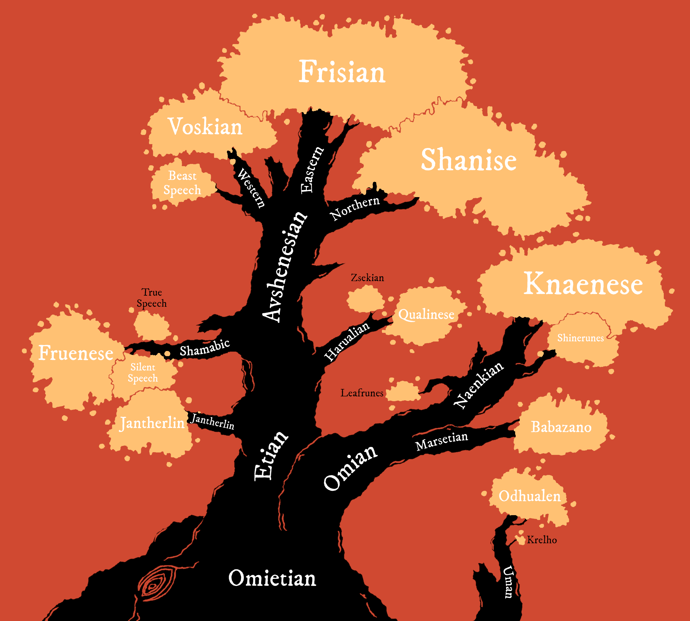

ll# Yuadrem
**WIP.**

Yuadrem is a supercontinent, assumed to be the only continent in the world Darhoc.
The topography is varied, split by four different mountain ranges.
Due to its large extension from north to south, the climate and ecology vary widely, from the tundras of Krudzal to the rain forests of Drejek.

Humes are believed to have settled Yuadrem at least at 1000 B.S., much before written history.
The first settlers were Et and Om, with the other kins arriving some time after the fall of the Om.
The original kins lived in relative peace up until the Schism, a volcanic eruption that brought the 40-year famine and the fall of the Et.
<!-- I should add lotsa links here... -->

## Geography

The vast landmass is surrounded by four oceans:

* The Frigid Ocean to the north-east, which is known for its low temperatures and abundance of migratory idzels.
* The warm Teal Ocean to the north-west, home to very varied life.
* The Burnt Ocean to the east, which strangely holds very little marine life.
* The Southern Ocean to the south, the least explored of the four.

Due to its size, Yuadrem is often divided into six distinct regions: the [Northern Territories](world/northern_territories.md), the [Westlands](world/westlands.md), the [Fractured Lands](world/fractured_lands.md), the [Sunland](world/sunland.md), the [Savage Territories](world/savage_territories.md), and the [Wildlands](world/wildlands.md).

## Demography
### Population
**TODO.**

### Ethnology
**TODO.**
<!-- % !TEX root = ../main.tex
\chapter{Kins} \label{ch::kins}
\DndDropCapLine{C}{ountless millennia before any of the}
modern kins were born, the ets were born into the land of Yuadrem.
% They were named by the other kins, their creations, due to their impressive size.
They were commonly known as the tall kin, for they usually stood well beyond 3 meters.
Their skin was of a pallid, almost bluish white color, and their eyes were as black as the abyss.
% Most ets didn't have any hair.

The species greatly developed their technology, which was biological in nature.
Free from aging and illness, they developed astonishing physical capabilities despite their apparent frailty.
Each et was indeed capable of shaping their own flesh, causing a great variety of characteristics in the many members of the kin.

Ets were obsessed with their individuality, and it was common for them to change their own appearance, molding their flesh to reflect their personality and philosophy.
Despite their longevity however, it was rare for new ets to be born, and the kin never grew to more than a few thousand members. -->

<!-- % \subsubsection{Relationships}
% Either by accident or by conscious decision, the tall kin created many of the modern peoples in experiments and studies.
% Most of these held a very high regard for the ets, with some even building entire churches to them.
% However, after it was learned that the they were responsible for the schism, all churches were forcibly shut down, and any adoration is severely punished. -->

<!-- \input{04kins/11gat}
\input{04kins/12ird}
\input{04kins/13marset}
\input{04kins/14oth}
\input{04kins/15moss}
\input{04kins/16fungal}
\input{04kins/19uman} -->

### Religion
**TODO.**
<!-- \DndDropCapLine{R}{eligion is an important part of life}
of the many cultures of Yuadrem.
Some worship specific pantheons of gods, others praise unpersonified concepts, and a selected few worship nature itself.
% In the times before the schism there was a wide belief that the tall kin could answer prayers, but their worship is now forbidden in most of the continent.

% The true existence of these divinities is a widely discussed subject, but their worship is undeniable.
From the nature-worshiping folk of Jenkash to the god-birds of Krudzal, each culture performs a set of rituals in the name of their deities, and some even claim to be able to channel their divine power.
While it might be hard to pinpoint the exact number of religions in Yuadrem, a few are built into the fabric of civilizations, and are easy to tell apart. -->

[Tanethism](religions/tanethism.md), [Tsalemism](religions/tsalemism.md), [Igneism](religions/igneism.md), [Cosmism](religions/cosmism.md).

<!-- \begin{table*}[b]%
    \begin{DndTable}[width=\linewidth, header=The Gods of Yuadrem]{p{2cm}p{0.8cm}p{3cm}p{1.8cm}X}
        \textbf{Name} & \textbf{Tides} & \textbf{Domains} & \textbf{Religion} & \textbf{Symbol} \\
        The Scholar  & B  & Reason, Knowledge     & Igneism   & A many-armed blue oth reading multiple books. \\
        The Zealous  & R  & Passion, Zeal         & Igneism   & A red dratl ird standing over a sand dune. \\
        The Star     & S  & Admiration, Fame      & Igneism   & A naked tall one, sometimes replaced by a shadow or a uman. \\
        The Equalist & I  & Justice, Equity       & Igneism   & An indigo gat holding a spear and a coin. \\
        The Altruist & G  & Empathy, Compassion   & Igneism   & A furtive golden marset carrying a basket full of eggs. \\
        The Sorrow   & -  & Balance, Punishment   & Igneism   & An indistinct cloaked figure holding a bloody heart. \\
        Changing God & -  & Secrecy, Manipulation & Rashiism  & A robed oth with a featureless bronze mask. \\
        Febrid       & B  & Intellect, Wood       & Tanethism & A gat forming a crescent moon with its horns. \\
        The Traveler & BR & Luck, Beer            & Tanethism & An indistinct figure cloaked in light brown robes. \\
        Vugar        & BG & Family, Fertility     & Tanethism & A gat prince dressed in a simple silver toga. \\
        Vahagn       & R  & Mountains, Fire       & Tanethism & A red quies holding a colossal mace. \\
        Genadi       & RI & Bravery, Love         & Tanethism & A grung warrior carrying a sword and a lute. \\
        Sakris       & RS & Fun, Wine             & Tanethism & A uman servant carrying cups and wine. \\
        Matevos      & S  & Glory, Water          & Tanethism & An ice zaloth holding a bident and a shield. \\
        Hanutsh      & SB & Teaching, Books       & Tanethism & A tsanek dressed in scrolls and paper. \\
        Tamaz        & SG & Wealth, Silver        & Tanethism & A gray ird eternally flying towards the sun. \\
        Phusinhe     & I  & The Stars, Metal      & Tanethism & A giant tortle with the visage of stars in its shell. \\
        Nadzim       & IB & Justice, the Sky      & Tanethism & A purple oth holding an abacus and a spyglass. \\
        Gathoz       & IS & Secrecy, Murder       & Tanethism & A kinless being with shifting body and face. \\
        Bagrat       & G  & Farming, Earth        & Tanethism & A gat farmer with tools made of gold. \\
        Havetish     & GI & Leadership, Tyranny   & Tanethism & A naenk holding a golden and an indigo spear. \\
        Mziva        & GR & Self Sacrifice        & Tanethism & A blonde marset with a flowered back. \\
        Jua\~nansiz  & G  & Day, Sunlight         & Tsalemism & A rainbow-colored heron followed by northern lights. \\
        Dzadsiz      & R  & Night, Darkness       & Tsalemism & A black raven surrounded by never-dispersing mists. \\
        The Observer & -  & Cosmos, the Unknown   & Cosmism   & A titanic three-eyed slug ridden with tentacles and appendages.
    \end{DndTable}
\end{table*} -->

### Languages
**TODO.**

<!-- \begin{table*}[b]%
    \begin{DndTable}[width=\linewidth]{X}
        \centering
        \includegraphics[width=0.99\textwidth]{01yuadrem/img/22languages_map.png}
    \end{DndTable}
\end{table*}

A great variety of languages permeate Yuadrem, both of natural spawn and artificial design.
While it is impossible to identify each tongue and its variations, many efforts have been done over the years to classify the common ones.

Based on lexical and grammatical similarities, languages are separated into four generations, and five distinct families.
The following tables classify these languages, pointing to their script and original speakers. -->

<!-- \begin{DndTable}[width=\linewidth, header=First Generation]{p{2.6cm}p{2.6cm}X}
    \textbf{Language}  & \textbf{Original Speakers} & \textbf{Script} \\
    Jantherlin         & Ets                        & Varies \\
    Babazano           & Marsets                    & - \\
    Knaenese           & Naenks \& Tsaneks          & Knaenese \\
    Outer Tongue       & -                          & Outer Tongue \\
    Mind Speech        & Zaloths                    & -
\end{DndTable}

\begin{DndTable}[width=\linewidth, header=Second Generation]{p{2.6cm}p{2.6cm}X}
    \textbf{Language}  & \textbf{Original Speakers} & \textbf{Script} \\
    Shamabic           & Oths                       & Shamabic \\
    Harualish          & Irds                       & Harualish \\
    Avshenese          & Gats                       & Avshenese \\
    Leafrunes          & Marsets                    & Leafrunes \\
    Shinerunes         & Naenks \& Tsaneks          & Shinerunes \\
    Seedspeech         & Gannagian Tsaneks          & - \\
    Krelho             & Tortles \& Grungs          & Krelho \\
    Odhualen           & Umans                      & Outer Tongue
\end{DndTable}

\begin{DndTable}[width=\linewidth, header=Third Generation]{p{2.6cm}p{3.2cm}X}
    \textbf{Language}  & \textbf{Original Speakers} & \textbf{Script} \\
    Silent Speech      & Oths                       & - \\
    Fruenese           & Sulian Oths                & Fruenese \\
    Zsekian            & Dratl Irds                  & Harualish \\
    Qualinese          & Jenkashian Irds            & Harualish \\
    Shanise            & Northern Irds \& Gats      & Shanise \\
    Frishian           & Jorea \& Dzorvepem         & Avshenese \\
    Voskian            & Voskferm \& Voskgrit       & Avshenese \\
    Thieves' Cant      & Rogues \& Thieves          & Thieves' Cant \\
    Slaadi             & Slaads                     & Krelho \\
    Feelspeech         & Zaloths \& Umans           & -
\end{DndTable}

\begin{DndTable}[width=\linewidth, header=Fourth Generation]{p{2.6cm}p{3.2cm}p{2.2cm}}
    \textbf{Language}  & \textbf{Original Speakers} & \textbf{Script} \\
    True Speech        & Palegna \& Sulia           & - \\
    Jol'naat           & Jenkash                    & - \\
    Beast Speech       & Jorea                      & - \\
    Conscript Tongue   & Cabb Goem-Rlamesh          & - \\
    Traveler's Cant    & Zaloths \& Umans           & Traveler's Cant
\end{DndTable} -->

<!-- % \paragraph{Old Tongue} A very complicated and intricate language spoken by the tall kin, the original settlers of Yuadrem.
% It's spoken form involves various complex articulations and the definition of a word can vary greatly based on the context.
% Additionally, each tall one had their own personal version of the written form, and others would understand it as much as they understood the individual.
% % This makes the reading of the old tongue extremely difficult for the kin that remain in the world, since understanding a particular tall one's scribbles essentially requires understanding their own version of the language.
% % Nowadays, only scholars and archaeologists understand the language, and it is not normally used anywhere.
% \paragraph{Marset Tongue} Every marset is already able to speak this strange, repetitive language.
% The marset tongue only has ten consonants, and ten verbs.
% % The rest of their vocabulary is built up from there, making their language very difficult to speak or understand by kins other than the marsets.
% Marset tongue can be spoken in one of two ways: soundlessly, through lip reading, or screamed as loud as possible, with no middle ground.
% The language cannot be written down.
% \paragraph{Naenk Tongue} Short words and strong consonants define the naenk tongue.
% Lacking lips and teeth, naenks make heavy use of their alveolar ridge and hard palate to produce syllables.
% The written form of the language involves carving lines and holes onto bark or stone.
% \paragraph{Outer Tongue}
% \paragraph{Mind Speech}

% \subsubsection{Second Generation}
% \paragraph{Dust Tongue}
% \paragraph{Ird Tongue}
% \paragraph{Gat Tongue}
% \paragraph{Leafrunes} Very easy to learn, but kept secret by the archer kin.
% A marset will teach this set of runes only to creatures that it deeply trusts, and only if it's strictly necessary.
% Ten leafrunes exist, all of which are used individually and to convey very simple meaning.
% % \textit{colony}, \textit{danger}, \textit{fun place}, \textit{hiding spot}, \textit{observation point}, \textit{predators}, \textit{road}, \textit{sacred place}, \textit{source of food}, and \textit{source of materials}.
% \paragraph{Shinerunes}
% \paragraph{Krelho}
% \paragraph{Nomad Tongue}

% \subsubsection{Third Generation}
% \paragraph{Silent Speech}
% \paragraph{Standard Language}
% \paragraph{Zsek Tongue}
% \paragraph{Qul Tongue}
% \paragraph{North Tongue}
% \paragraph{Beetle Tongue}
% \paragraph{Gilded Tongue}
% \paragraph{Thieves' Cant}
% \paragraph{Slaadi}
% \paragraph{Frost Tongue}
% \paragraph{Bog Tongue}
% \paragraph{Feelspeech}

% \subsubsection{Fourth Generation}
% \paragraph{True Speech}
% \paragraph{Jol'naat}
% \paragraph{Beast Speech}
% \paragraph{Conscript Language}
% \paragraph{Traveler's Cant} -->

<!-- \subsubsection{Language}
The tall kin spoke a very sophisticated language, known as jan-theth rlin, simplified as jantherlin.
This language allowed for a very profound expression of one's emotions and inner state, and is still used in poetry to this date.
For when deeper communication is needed, ets could meld their bodies and share thought, but the practice was only used in special rituals or to express especially complex abstract concepts.

As for written word, it was customary for the tall kin to chisel the stone, commonly carving a great variety of images alongside the text.
While this written language originates from jantherlin, each tall one had its own personal version of it.
Other ets could only comprehend one's writing as much as they understood the writer.
This makes the study of jantherlin extremely difficult to modern archaeologists.
% This makes the reading of the jantherlin extremely difficult for the kin that remain in the world, since understanding a particular tall one's scribbles essentially requires understanding their own version of the language.
 -->

## History
**TODO.**
<!-- \subsection*{Ancient History}
% !TEX root = ../main.tex
\begin{figure}[H]
    \centering \includegraphics{01yuadrem/img/30history_i.png}
\end{figure}

\section{History} \label{sec::history}
% History is known in detail thanks to the dutiful oths that recorded it under Tol's guidance.

\newpage

\subparagraph{682 BS --- First Communion} In the middle of the Dead Sea, the et Ukarilth merges with a deceased higher one embryo.
This transforms the tall one into an insane visage of their former self.
The church of Ukarilth is later founded to attempt communication with the et.

\subparagraph{592 BS --- Birth of Gats} The search for the Lung of Ur begins, an artifact of great value to the tall kin.
The indigo school of the et Thul-yharch creates the hardy gats, believing the relic is below the surface.

\subparagraph{547 BS --- Birth of Irds} With underground search proving unsuccessful, the red school of Zyl'rech births the mobile irds.
Taking to the skies, they survey land and ocean, hoping to find clues of the Lung's location.

\subparagraph{523 BS --- Birth of Marsets} The gold school of Tosh-drieln produces the arboreal marsets.
They explore the thick and dark jungles of Yuadrem with ease.

\subparagraph{451 BS --- Birth of Oths} Under mysterious circumstances, oths are created by the et Tol.
Before disappearing, the tall one teaches them writing, and they begin recording history and compiling the findings of the ets and their progeny with great care and detail.

\subparagraph{397 BS --- Ctereth's Workshop} To cope with the uncontrolled population growth of the new kins, the et Ctereth digs a deep cavern in the middle of the Dead Sea.
Inside it, the tall one builds a workshop and tirelessly crafts qualar to gift the newborns sentience.

\subsection*{Nadir}
\subparagraph{217 BS --- The Rise of the Spire} The tall kin, apparently done with their search, create the spire at the place where Ukarilth found the higher one.
They build the stone city of Jan'krug atop the mountain.
The progeny kins, now left alone, are forbidden from accessing the Dead Sea and, incapable of producing qualar, are forced to fight among themselves.

\subparagraph{209 BS --- First Lost Ones} The first plains gats and chu'ash oths are born, separated from their kins by their lack of qualar.
% While ird and marset lost ones also exist, the lack of a qualars doesn't affect these kins as much as their siblings, perhaps due to their wilder nature.

\subparagraph{179 BS --- First Gat City-states} The gats, always fighting adversity, establish the three city-states of Fiele, Avshen, and Alagyaz.
With careful birth control techniques, they manage to maintain a stable population.

\subparagraph{144 BS --- First Siege} A group of three irds known as ``The Feathered Sunrise'' infiltrates the Dead Sea and steal tens of thousands of qualar from Ctereth.
The nations of Krudzal, Harual, and Hulnar are later established by their descendants.

\begin{figure}[H]
    \centering \includegraphics{01yuadrem/img/30history_ii.png}
\end{figure}

\subparagraph{92 BS --- Naenks \& Tsaneks Discovery} Trying to find a home, a group of stray marsets known as the Ovovians, stumble upon the naenks and tsaneks of Drejeck.
These two are inexplicable kins born from mold and fungi respectively.

\subparagraph{51 BS --- First Artificial Qualars} The gat Jirar the bonecarver creates a technique to craft rough qualars imitations.
By passing the practice to the gat's disciples, Jirar unshackles the population number of the kins, and boosts Alagyaz's economy to unprecedented levels.
% To date, only gat master bonecarvers have managed to use the technique. One bonecarver's qualar count usually doesn't go above the thousands, but as populations grow so does the need for qualar.

\subsection*{Great Famine}
\subparagraph{0 --- The Schism} The tall kin's folly causes the schism.
The spire, now revealed to be a dormant volcano, catastrophically erupts.
The event destroys Jan'krug and most of the ets.
The spewed ash blocks off sunlight for four decades, starting the age known as the great famine.

The explosion causes a portal known as the Sizzling Gate to be opened in a cave inside of the spire.
This door leads to Nyx, a strange and primal plane that exists outside of Yuadrem.
From the portal spew forth the foreigner kins: the adventurous tortles, the violent grungs, and the ingenious umans, along with the Nyxborn.

\subparagraph{1 AS --- Second Siege} The foreigner's horde, a great army of tortles, grungs, and umans, siege Ctereth's workshop.
They're successful, and the great number of qualar stolen is used to start their own settlements in Yuadrem.

\subparagraph{4 AS --- Zaloths Discovery} The zaloths, a kin made of fire, ash, thunder, and hail, walk down from the ruins of Jan'krug.
They freely roam Yuadrem, following a nomadic lifestyle that keeps most away from civilized society.

\subsection*{Age of Heroes}
\subparagraph{38 AS --- End of the Great Famine} Satisfied with a death toll in the tens of millions, the ash clouds from the spire disperse, finally ending the great famine.

\subparagraph{57 AS --- Quies Discovery} A group of gat voyagers from Avshen rise up to Jan'krug, finding the city ruined beyond repair, covered by solidified lava.
However, what they do find beneath the ruins are the quies, a new kin.
Quies are the last kin created by the ets, and are brought back to Avshen.
They easily integrate into gat society, despite their physical differences.

\subparagraph{71 AS --- Start of the Eternal War} The newly born kingdom of Krudzal in the north begins a war against the stone giants of the northern territories.
The war rages to this day, with little obtained by the thulkraka irds.

\subparagraph{99 AS --- Jenkash's Separation} A blossoming nation of qulbaba irds is split into forty-five separate tribes by ideological differences.

\begin{figure}[H]
    \centering \includegraphics{01yuadrem/img/30history_iii.png}
\end{figure}

The tribes that will eventually become Jenkash are bound to constant conflict, unable to establish a unified government for more than a hundred years.

\subparagraph{102 AS --- Third Siege} Inspired by their siblings lost three centuries ago, the Army of Healing is formed.
Mainly composed of gats and oths, they successfully invade Ctereth's dwellings, then personally bringing the stolen qualar to the bughna gats and the chu'ash oths, re-integrating them into civilized society.

\subparagraph{141 AS --- Birth of Isken} Among the dark forests of the Chirping Wilds, the grung empire of Isken is formed.
Initially secretive, they will soon become one of the most fearsome forces in Yuadrem.

\subparagraph{143 AS --- Babaian Genocide} The grungs of Isken easily crush the marset nation of Baba, systematically killing the marsets until very few are left.

\subparagraph{144 AS --- First Isken-Harual War} Ever hungry for power and land, the Iskean empire attacks the Harualish tribes of the Chirping Wilds.
This is the start of a long sequence of slow and bloody wars that will last for more than two centuries.

\subparagraph{174 AS --- Discovery of the Tides} The oths from the temple of Ignelli, led by Hashim, unearth the phenomenon of the tides, learning of its influence on the kins of Yuadrem.
The discovery revolutionizes the way the kins perceive their own feelings and motivations, and leads to them questioning the nature of sentience itself.

\subparagraph{189 AS --- Fourth Siege} To cope with their ever-growing populations, a temporary alliance is formed between the dratl ird houses of the west and the grung empire of the east.
Their union leads to the fourth and final successful siege of Ctereth, enabling a great growth for the Hulnar and Iskean empires.

\subsection*{Age of Nations}
\subparagraph{195 AS --- Founding of the Seven Kingdoms of the Sea} Ever-growing in numbers, the gat city-states coasting the Whaler's Sea coalesce into nations, each under its own king.
With all the events happening in one year, the formation of the Seven Kingdoms of the Sea initiate an age of prosperity for the horned and retainer kins.

\subparagraph{201 AS --- Invention of Metal Ships} Edren, a thulkraka ird from Krudzal, designs and invents the first ironclad ship.
The design, named after the ird's son, Durkin, boosts Krudzal's trading capabilities and kick-starts a great colonization campaign.

\subparagraph{212 AS --- Birth of the Dead Sea Clans} Imitating their neighbors to the north, many uman, dratl ird, and plains gat clans are established in the Dead Sea.

% These clans however are very different from the civilized kingdoms of the north.
% Warlords are elected by strength, and their territories are as shifting as the erratic sandstorms.

\begin{figure}[H]
    \centering \includegraphics{01yuadrem/img/30history_iv.png}
\end{figure}

\subparagraph{229 AS --- Formation of the Jenkashian Empire} Driven by inner conflict, the irds of the Qul Archipelago exhaust their natural resources.
This forces them to prematurely end their quarrels, and begin invading and pillaging the surrounding territories.

\subparagraph{231 AS --- Ededian Genocide} The Ironlakes Island is almost completely overtaken by Jenkash, decimating the marset population and forcing most into exile.

\subparagraph{247 AS --- Tidal Sway} Hailing from Ignelli, the oth Narr from the Rashiist school of thought performs an uncanny ritual to harness the power of the tides.
This accidentally triggers the tidal sway.

The oth summons the Sorrow into Yuadrem, ending the life of most Rashiists and ravaging the Wildlands entirely, blocking access by land to the southern regions of Yuadrem.

\subparagraph{272 AS --- Fifth Siege} The Iskean grungs, banned from buying artificial qualar from Khedrat, attempt a new siege upon Ctereth's workshop.
This time however they fail, stopped by an unsuspected force: the newly formed Dead Sea clan of Dzarog.
Dzarog is a clan of umans and gats that live in dens around the spire, and protect Ctereth's caverns for yet unknown reasons.

\subparagraph{281 AS --- Creation of Geomancy} The ird nation of Hairuus, protected from Isken by the splitting mountain range, develop the art of Geomancy.
As a test of their mastery of it, they elevate an island at the middle of the Shield Lake, where their capital, the Nest, is built.

\subparagraph{304 AS --- Invention of Gunpowder} Hailing from the young nation of Sulia, the oth Karmin discovers gunpowder.
With this new firepower, many engineers from Sulia design and build varied weapons, like fire spears, hand-cannons, and muskets.
These new weapons give them a proper combat advantage, allowing them to defend themselves from the savage nomadic tribes of the blank plains, and slowly expand their territories to the east.

\subparagraph{331 AS --- Creation of Windherding} The uncommonly peaceful irds from the Dentrala tribe in Jenkash develop the art of windherding.
The other tribes quickly adapt this art for combat, leading to the Drejeck wars against the naenks of Gannag and the Dratl'fal wars against the declining empire of Hulnar.

\subparagraph{340 AS --- Siszgoel's Independence} Siszgoel, a long-standing colony of Krudzal, declares independence.
The nation of Kaldrathal is born, under the rule of the warrior queen Ialul.
The natural deposits of nitrate in the country's island of residence, Krejek, boosts a powerful gunpowder industry, quickly matching that of Sulia.

\begin{figure}[H]
    \centering \includegraphics{01yuadrem/img/30history_v.png}
\end{figure}

\subparagraph{354 AS --- Birth of Ribinhep} Umans, a kin commonly hunted an enslaved, manage to establish permanent settlement in the isle of rust.
Naming themselves Ribinhep, they start conquering the northern fjords using their unique mercury weapons, fighting under the rule of the frostburn king Kuin.

\subparagraph{389 AS --- End of the Isken-Harual Wars} After 248 years, the Isken-Harual wars end, with Isken crushing almost all of the ird tribes.
The grung empire quickly proceeds to attack the Byurev nation, attempting to conquer territories up north.
They are however stopped by the gats, prepared for such an invasion decades ago.

\subparagraph{411 AS --- Vanishing of Hairuus} The lake-based country of Hairuus suddenly vanishes, soon after elevating new land for their growing capital.
Rumors that the lake is haunted begin spreading, and nations avoid claiming the empty territories and abandoned cities for fear of this mysterious curse.

\subparagraph{440 AS --- Gannag Invasion} Seeing that the Jenkashian forces are focused on conquering the mainland, the armies of Gannag suddenly invades the Qul Archipelago under the command of Kutsa the sharp.
In few weeks they manage to conquer half of Jenkash's homeland, taking prisoner irds as sacrifices to use as birth corpses.

\subparagraph{461 AS --- Kaldrathal's Conquest} Most of the islands of the Arctic Archipelago are claimed by Kaldrathal, who establishes a new form of government that tries to represent the taken territories.

\subparagraph{498 AS --- Invention of Blast Weapons} Reut, an engineer from Drer, invents a new use of Sulia's gunpowder: Blast weapons.
Used for close-quarters combat, blast weapons aim to both surprise and immolate the enemy.
Among the most famous examples are the flame vent, the firecrackers and the flaming pole-arms.

\subparagraph{533 AS --- Creation of Wordbinding} In collaboration, the many oth houses of Palegna create the art of Wordbinding.
The technique quickly gains traction, as it adds a method for trustless trade between peoples and nations.

% \subparagraph{553 AS --- Na'ane's Founding} A large circle of tsaneks led by Tsehant, tired of their class-based society, made a pilgrimage to the fog gorge.
% They establish in it, and form the independent nation of Na'ane.

\subparagraph{577 AS --- Establishment of Tanethism} The king of Khedrat, Olag the Immortal, establishes the recently born Tanethism as the official religion of the nation.
The other Kingdoms of the Sea follow soon after, and Tanethism is quickly adopted by most gats.
% Here is when bonereading becomes accepted in the seven kingdoms.

\subparagraph{589 AS --- Appearance of Fo} Strange, twisted creatures start attacking any village coasting the Shield Lake, causing havoc.
Fo, the kinless inhabitant of the nest is quickly blamed for the creation of this creatures, but all attempts to reach the being have failed.

\begin{figure}[H]
    \centering \includegraphics{01yuadrem/img/30history_vi.png}
\end{figure}

\subsection*{Golden Age}
\subparagraph{591 AS --- Hulnar's Demise} The strong alliance between the nations of Khedrat and Sulia defeats Hulnar in the Sylvan wars, allowing both nations to occupy a segment of the Ichor mountains and the entirety of the Sylvan canyon.
This act helps mitigate the pirates' presence in the Whaler's Sea, kick-starting an era of peace and trade for the coastal nations.

\subparagraph{599 AS --- Invention of Steel Firearms} The inventive Kaldrathian engineer Seja combines Krudzal's quench-hardened steel with her new refined gunpowder.
The explosive mix leads to the development of fierce steel-based weapons, including long-range cannons, wheel-lock pistols and sophisticated rifles.

\subparagraph{607 AS --- Invention of the Steam Engine} Away from the economic center of Yuadrem, the Na'anian tsanek Nugut invents the steam engine.
Originally used simply to drain the Na'anian coal mines, the tsaneks were quick to notice its potential and found hundreds of applications for the engine over time.

\subparagraph{621 AS --- The Penance} A surreptitious ritual known only as ``The Penance'' is carried by the citizens of Dzarog.
From the top of the spire, they summon a horrible being known as Cabb Goem-Rlamesh into Yuadrem.
The colossal amalgamate of flesh slowly drags itself towards the east, ferociously protected by the Dzarogian armies.

\subparagraph{628 AS --- Krudzal's First Victory} Using modified Kaldrathal cannons, Krudzal finally manages to kill a stone giant, claiming their first victory in the Eternal War.
% The event strikes fear on the giants, and Krudzal manages to claim their first territories in the mainland.

\subparagraph{635 AS --- Dissolution of Hulnar} Heirless, the king Sul'rech of Hulnar suddenly dies at a young age.
The dwindling kingdom is split into smaller houses, weak ghosts of Hulnar's old glory.

\subparagraph{655 AS --- Cabb Goem-Rlamesh's Launching} The harrowing immensity, Cabb Goem-Rlamesh, reaches the Burnt Ocean and settles some kilometers off the coast of the dry savanna.
% It becomes known as the breathing city.
% All expeditions to the island have ended poorly.

\subparagraph{659 AS --- Separation of Khedrat} The newly-conquered westernmost territories of Khedrat quickly become tired of monarchy, and peacefully claim independence.
Abandoning old traditions, the new countries of Viphogher and Dnomit embrace democracy: a new, king-less form of government.

\subparagraph{671 AS --- Jenkash's Reclaiming} Forced by Gannag to halt their conquest, the Jenkashian empire focused entirely on re-taking the Qul Archipelago.
Savage battles are fought, and to date they've managed to reclaim most of their lost homeland.

\subparagraph{673 AS --- Present Day} -->

## Islets
The Penance split Yuadrem into many different regions, called islets.
Exploration outside the islets has been very limited, and no contact has been made between them insofar.

Islets are commonly named for the regions in which they lay, and a (not exhaustive) list of them is:

* Fesh Peninsula.
* Katajthon Islet.
* Wildlands.
* [Krugghom Islet](islets/krugghom_islet/index.md).
* [Steldan Islet](islets/steldan_islet/index.md).

---
For documentation on editing this wiki, check out:

* [mkdocs-material](https://squidfunk.github.io/mkdocs-material/creating-your-site/).
* [mkdocs.org](https://www.mkdocs.org).
