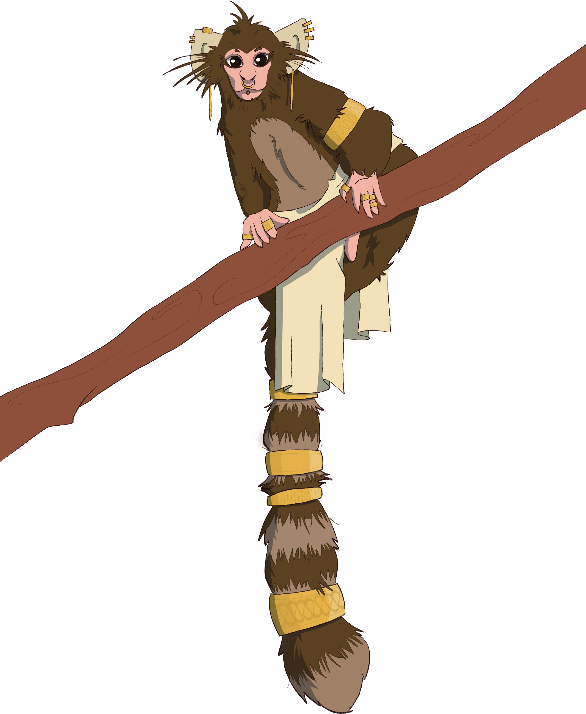

# Imates
The god-tree [Om](../religion/godtrees/om.md) created imates to defend the oric god from [Et](../religion/godtrees/et.md) during the [War of Autumn](../history.md#war-of-autumn). While not particularly suited for war, the kin fiercely defended their god-tree until the [Schism](../history.md#war-of-autumn). They were blessed with Word for their devotion. After the burning of their parent, imates escaped total slaughter by migrating to the south, spreading thorough the southern reaches of Yuadrem.

Due to their many migrations, imates are now separated into two: the militaristic, war-hardened people that established the Kingdom of Om<!--TODO:LINK---> with the help of the [irds](hume.md#ird-culture) of Gronselar<!--TODO:LINK--->, and many groups of diverse nomads that roam the remaining forests of the Fesh Peninsula.

<!--NOTE: IMATE ETHNICITIES:
    * Kingdom of Om.
    * Random forest communities.
    * Gronselar.
--->

<!----------------------------------------------------------------------------->
## Physical description
Imates bear some resemblance to humes: both kins poise the bulk of their weight on two legs; they have the same number of digits; and are able to express their emotions through words and facial expression. However, the body of an imate is covered in hair which ranges in color from white, through many shades of brown, to black. Lacking the [gats'](hume.md#gat-culture) Blessing of Color, no hints of Red or Yellow is seen in their hair. Then, a common trait to all imates are their oversized ears, which are surrounded by a tuft of white hair.

Imates are separated into two different species: the oras and the arsets. Oras have larger bodies—the average adult stands upright at around 2 meters, but they would struggle to maintain this posture for long. Hunched, they're not taller than a meter and a half. They have strong bodies and long arms, and often weight more than 100 kilograms.

Arsets are small in comparison, usually not reaching more than 90 centimeters in length and 15 kilograms in weight. While they are not as strong as the oras, they have longer claws and a long, striped tail, both of which they use to climb with great dexterity.

Imates are considered adults when they reach an age of 10 years, and tend to live up to 70 or 80 years. As they age, their hair changes color to display particular signatures, thanks to the Blessing of Word. This, in addition to conserving the vigor of the elders, extends their natural age in a manner similar to the tattoos of a hume sorcerer<!--TODO:LINK--->.

|  |
|:---------------------------------:|
| _Oras farmer and spirit guide from Saefel. While imates don’t usually wear clothes, many who live among humes are wearing plain, colorless loincloths._ |

<!----------------------------------------------------------------------------->
## Clothing and accessories
Due to their fur and proclivity to warm and humid weathers, imates in general do not cover their bodies in clothing. It is common to just wear a loincloth, but some include more fabrics with a purely aesthetic purpose. Imate shamans are the exception: since their body hair would make tattoos ineffective, they wear long ribbons of fabric with apomantic signatures, forming spells around their bodies. While they cannot cast spells as fast as tattooed hume sorcerers, this system allows them to change the signature sets with ease.

Imates wear an abundance of accessories as a form of self expression. Common examples include bands in the arms and legs, rings, and braid rings. Piercings in the face and ears are the sign of adulthood in the kin. These accessories are often made of bone, wood, copper, or gold—an imate puts more value in the complexity of the design than the material from which it was made.

|  |
|:---------------------------------:|
| _Arset hunter from Saefel, perched on a branch. Imates traditionally wear refined gold jewelry, which is often shared among their families._ |

<!----------------------------------------------------------------------------->
## Origins and history
After the Schism, imates were left without the canopy of Om to call home. As such, they fled south of the Turtle Sea, surviving the [40-Year Famine](../history.md#age-of-winter) thanks to the abundant flora and fauna of the southern regions. These settlements were short lived, however, as after recovering from the famine, gats took to hunting them en masse, sparking the [Babaian Wars](../history.md#age-of-spring).

The imates that survived kept migrating south, settling in a variety of regions on the southernmost reaches of Yuadrem. Many gained an affinity with the yellow [god-tree Uld](../religion/godtrees/uld.md), who lived in the Wildlands. Others migrated to the southernmost points of the continent—the Elderberry Wilds—while a large group to the Ironlakes Island.

Contact between hume and imate was almost completely lost after the [Penance](../history.md#age-of-sap). No signs of imates were found up until 731 A.S., when they sailed in ships from Gronselar<!--TODO:LINK---> towards the islands of the Turtle Sea. They expelled the gats in the [War of Summer](../history.md#age-of-sap), reclaiming their historic territory around Om. Over the years, however, many have refused this conflict, choosing to settle the forests surrounding the sea.

<!----------------------------------------------------------------------------->
## Culture and traditions
**Village as family.**
Imates have fully communal families. An imate will usually not know who their particular parents are, and they regard the village in which they were born as their family. When a village grows too large, it will often split—the "mother" family will remain in the old environment, while the "daughter" embarks on a journey to settle.

An imate's family is for life. Adoption sometimes occurs between mother and daughter families, but even in this context it is very rare.

**Dual dwellings.**
Traditional imate villages consist of two room styles. The larger are wood and fiber circular huts built on the trunks of trees, which are used to house the adult oras and as storage. Where the dirt allows, patches of farmland surround these huts, which are worked by oras.

Then, the branches of these same trees are covered in interconnected chambers, built by weaving grass and plant fibers. Three types of these arboreal rooms exist: shared housing for adult arsets, nurseries for all younglings, and farming rooms, in which arsets leave a mixture of chewed leaves and bark, growing mushrooms from otherwise inedible foraged material.

In Fesh, it is common to see one or two of these arboreal communities inside towns and villages. While historical differences still cause a rift between kins, the Penance has forced a certain degree of cooperation from these mixed communities.

**Death and return to Om.**
It is a common belief that a dead imate's soul can only return to Om if its body rots under the earth. Imates traditionally bury their dead below their farmlands, and as such the huts of the oras serve to mourn the recently dead.

For this reason, imates find the [elves](elf.md) cycle of birth hard to accept, since it retards their process of reunification with their god. For the same reason, burning a dead body is extreme sacrilege—if an imate dies by burning or in any way that won't allow its body to rot, their soul will never find its way back to Om.

**Specialized roles.**
Due to their differences, oras and arsets tend to take different occupations in their society. Arsets, being small and mobile, hunt, scout, and trade with neighboring villages. Oras, larger and stronger, will defend the village, tend plantations, attend the young, and craft various items and accessories. Traditionally, one or more oras will act as the village shamans, conducting rites and communing with the recently dead.

**Tradition and Tanethism.**
Imate tradition follows the belief in the divinity of the [god-trees](../religion/index.md#god-trees) and their relation to the Ring of Color<!--TODO:LINK--->. They associate the god-trees to the fundamental signatures of color<!--TODO:LINK--->, and have unique signatures for each of the seven trees. In general they don't place Om above the other god-trees, but they do praise their god more than the others.
<!-- NOTE.
    Whenever I work on the imate apomantic system, use the seven trees as base.
-->

While many have adapted to Tanethism, their traditional cosmology does not recognize the [mevic gods](../religion/index.md#mevic-gods) as the makers of the god-trees. They do, however, recognize [Pheter](../religion/primordials/pheter.md) and [Nix](../religion/primordials/nix.md) as the forces of creation, and recognize the connection that [Illuminants](../religion/index.md#illuminants) have with Pheter.

<!----------------------------------------------------------------------------->
## Names
Imates speak [babazano](../languages/index.md#omian-branch). As such, their names are frequently in this language. During their childhood, an imate will be assigned many names by their family members, usually based on distinctive features and particular accomplishments, such as "she-who-sings", or "picks-many-fights". They will settle on a name of their choice as they reach adulthood, often picking their favorite one from their assigned names.

Imates also have a second name, which is inherited from their family. This is the name of the village in which they were born, adding the prefix *do*, which translates literally to "name" in babazano. Imates that go through adoption usually keep their original village name.

A few common names are:
Anana, Baba, Badaze, Ebezu, Ezevu, Ezeze, Nenuzu, Nono, Nuzu, Ododo, Odozu, Ovozu, Uvu, Uvozu, Veve, Vevozu, Vovo, Zazu, Zenuvu.
